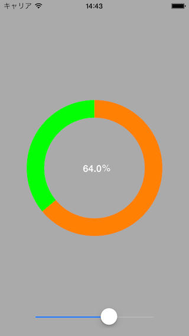

# DrawArcSample

最近よく見かける円弧状のプログレス表示を実現するための習作。

## スクショ



## 動作環境

iOS7〜

## 使い方

ArcViewを表示したいViewControllerに追加。

```Objective-C
self.arc = [[ArcView alloc] initWithFrame:self.view.frame];
 [self.view addSubview:self.arc];
```

0〜1の値を渡して描画。

```Objective-C
// パーセント表示の更新
[self.arc updateLabelValue:self.slider.value];
    
// 円弧の描画の更新
self.arc.updateValue = self.slider.value;
[self.arc setNeedsDisplay];
```
※サンプルでは、手動で値を変化できるように、スライダーからの値を渡しています

## ライセンス

MITライセンス

## 開発者

[@keygx] (<https://twitter.com/keygx>)
